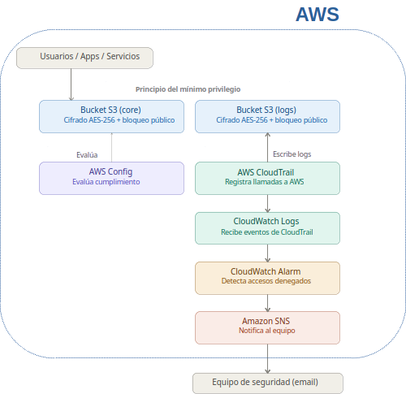

# Protección del Core – Blue Wave Fintech

**Entorno:** AWS Cloud (AWS Academy Learner Lab)  

**Herramientas:** AWS CLI, Terraform, AWS Management Console, Git

**Propósito:** Proyecto práctico de arquitectura cloud, seguridad e Infraestructura como Código (IaC).


---

## 1. Contexto y Objetivo

El objetivo de este proyecto es simular el aseguramiento de la infraestructura base para una fintech hipotética (**Blue Wave**). Partiendo de un escenario donde el almacenamiento carecía de controles estrictos y no existía visibilidad de eventos ni monitoreo continuo, se implementó una solución para cubrir cuatro pilares esenciales:

1. **Protección del almacenamiento (S3):** Cifrado predeterminado, bloqueo absoluto de acceso público y eliminación de ACLs heredadas.
2. **Auditoría y trazabilidad (AWS CloudTrail):** Registro centralizado de llamadas a las APIs de AWS en un bucket exclusivo de logs.
3. **Gobernanza continua (AWS Config):** Evaluación automática del estado de cumplimiento de los buckets S3.
4. **Monitoreo y alertas (CloudWatch & SNS):** Transmisión de eventos de auditoría en tiempo real, detección de intentos no autorizados y notificación por correo.

---

## 2. Arquitectura Implementada



*Figura 1: Diagrama de la arquitectura implementada.*

---

## 3. Componentes del Proyecto

### 3.1 Almacenamiento Seguro (Amazon S3)
* **`blue-wave-secure-bucket-bw`:** Bucket para almacenar datos operativos del core.
* **`blue-wave-cloudtrail-logs-bw`:** Bucket secundario utilizado como contenedor de logs de auditoría.
* **Controles:**
  * Cifrado en reposo obligatorio (`SSE-S3 / AES-256`).
  * Bloqueo total de acceso público (`Block Public Access`).
  * Desactivación de ACLs (`BucketOwnerEnforced`).

### 3.2 Auditoría (AWS CloudTrail)
* Se configuró el rastreador **`blue-wave-audit-trail`** para registrar todas las operaciones de la cuenta.
* Se asoció una **Política de Bucket (`aws_s3_bucket_policy`)** que permite a CloudTrail escribir los logs exigiendo la condición `bucket-owner-full-control`, asegurando que la cuenta mantenga el dominio de sus archivos de auditoría.

### 3.3 Gobernanza (AWS Config)
* Se desplegaron dos reglas gestionadas (*Managed Rules*):
  * `s3-bucket-public-read-prohibited`: Verifica que ningún bucket sea de lectura pública.
  * `s3-bucket-server-side-encryption-enabled`: Confirma que el cifrado en reposo permanezca activo.

### 3.4 Monitoreo y Alertamiento (CloudWatch + SNS)
* **Log Group:** `/aws/cloudtrail/blue-wave-audit-logs` con una retención de 7 días para optimizar costos de almacenamiento sin perder visibilidad operativa.
* **Metric Filter:** Patrón JSON que escanea los logs buscando errores de autorización (`UnauthorizedOperation` / `AccessDenied`).
* **Alarma:** Se activa al detectar 1 o más intentos denegados en un rango de 5 minutos, enviando una notificación inmediata mediante un tema de **Amazon SNS** suscrito por correo electrónico.

---

## 4. Notas Técnicas y Adaptaciones en la Implementación

El proyecto fue diseñado para desplegarse mediante **Terraform**. Sin embargo, al ejecutarse dentro del entorno restringido de **AWS Academy Learner Lab**, se presentaron dos limitaciones de permisos reales que requirieron ajustar la estrategia:

1. **Creación de Buckets en S3:** El proveedor de Terraform intenta consultar metadatos avanzados durante el aprovisionamiento (como *Object Lock*), llamadas que son bloqueadas por las Service Control Policies (SCP) del laboratorio.
   * **Solución:** Se diseñó el script **`aws-cli.sh`** para crear la estructura inicial de los buckets S3 (operación permitida por el entorno) mediante la AWS CLI. Posteriormente, se administran sus políticas, cifrado y accesos mediante Terraform.
2. **Delivery Channel en AWS Config:** La creación de un *Delivery Channel* hacia S3 requiere permisos elevados para crear/modificar roles IAM y STS, algo restringido para el rol `LabRole` asignado.
   * **Solución:** Se descartó el canal de entrega persistente y se utilizó el motor de evaluación nativo en tiempo real de AWS Config en el plano de control, logrando validar las reglas de cumplimiento directamente en la consola.

---

## 5. Instrucciones de Despliegue

Para desplegar correctamente la infraestructura, es **indispensable seguir el orden especificado**:

### Paso 1: Ejecutar el script base en AWS CLI
Crear los buckets S3 y la estructura básica que Terraform necesita importar/asociar:

```bash
chmod +x aws-cli.sh
./aws-cli.sh
```

### Paso 2: Aprovisionar con Terraform
Una vez creados los buckets por CLI, inicializar y aplicar el plan de Terraform para levantar las políticas de S3, CloudTrail, reglas de AWS Config, CloudWatch y el tema SNS:

```bash
cd terraform/
terraform init
terraform plan
terraform apply
```

---

## 6. Estructura del Repositorio

```text
.
├── README.md                  # Información principal del repositorio
├── Enunciado de proyecto.pdf  # Enunciado del proyecto como tal. Se describe todo lo solicitado.
├── aws-cli.sh                 # Script inicial para aprovisionar buckets S3 base
├── docs/                      # Documentación del proyecto (diagramas, capturas e informe técnico)
└── terraform/                 # Archivos de configuración de Terraform (.tf)
```

---

## 7. Conclusiones

Este proyecto sirvió para aplicar buenas prácticas de seguridad e Infraestructura como Código sobre AWS, pero también para enfrentarse a problemas de permisos y limitaciones reales de entorno. La solución final entrega una arquitectura auditable, con monitoreo activo ante accesos no autorizados y con un uso adaptado de IaC para superar las barreras técnicas del laboratorio.