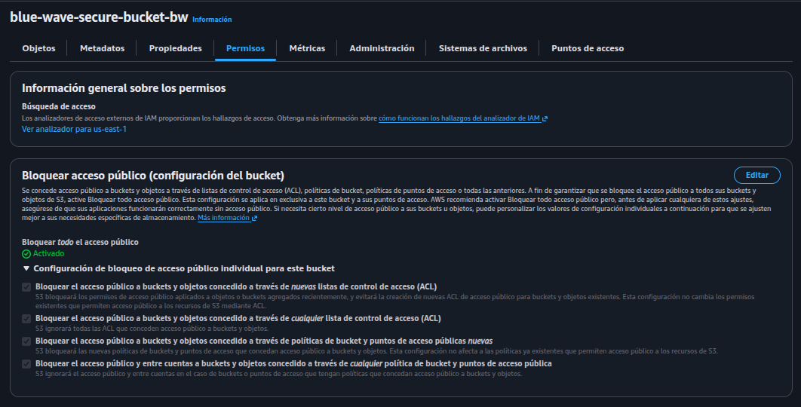
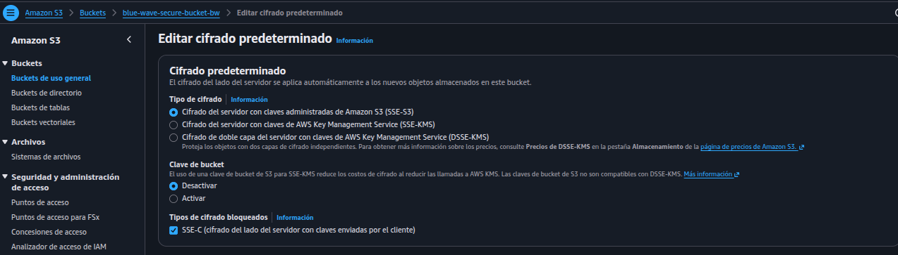
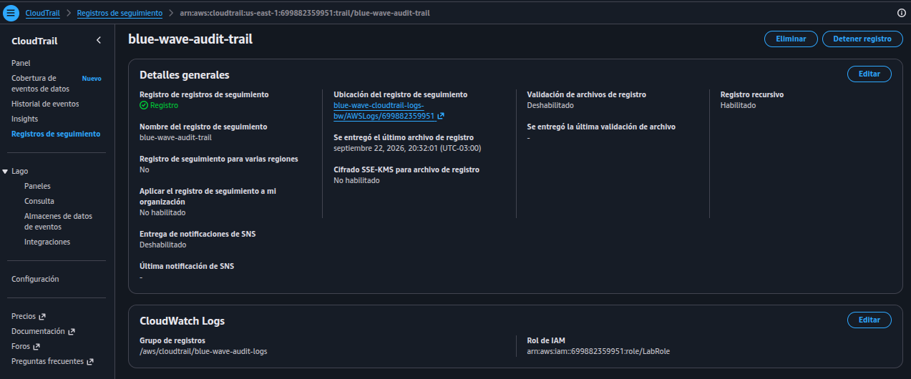
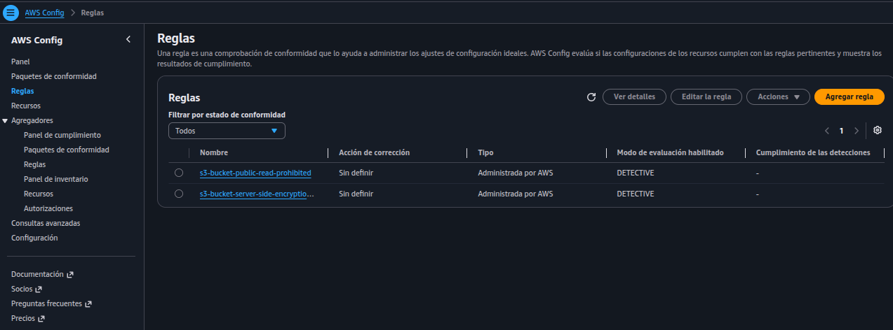
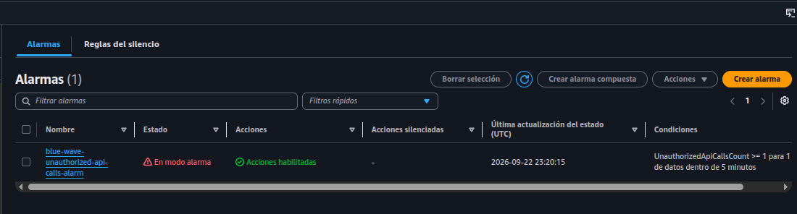
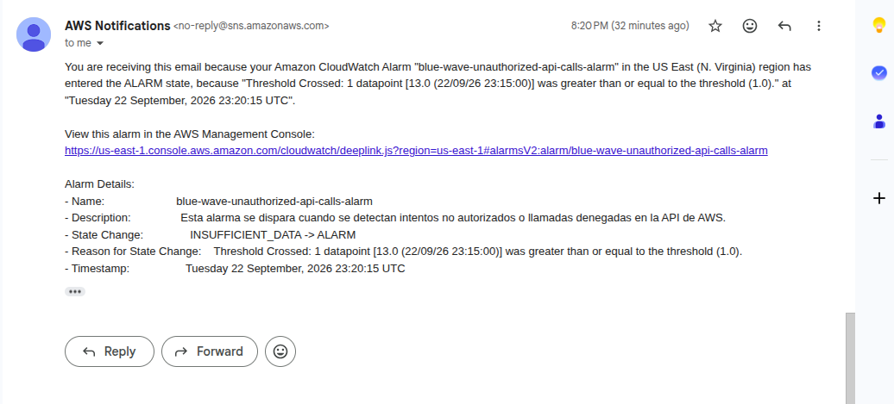

# Informe del proyecto: Cloud Secure

**Nombre:** Jairo Morales

**Proyecto:** Protección del Core – Blue Wave Fintech

**Entorno:** AWS Academy Learner Lab

**Herramientas:** AWS CLI, Terraform, AWS Management Console, Git

## 1. Introducción

Blue Wave es una fintech que ya había migrado su core de negocio a AWS. El problema es que, al revisar esa infraestructura, aparecieron varios puntos débiles: el almacenamiento de datos no tenía controles de seguridad suficientes y no existía ninguna forma de saber qué pasaba dentro de la cuenta ni de detectar algo fuera de lo normal. Tampoco había manera de comprobar si los recursos cumplían con configuraciones mínimas de seguridad, algo que en el rubro financiero es un requisito y no un extra.

Para resolver esto, el proyecto se dividió en cuatro partes:

* **Marco de seguridad:** dejar claro qué le corresponde asegurar a AWS y qué le corresponde asegurar a la empresa, usando como base el Modelo de Responsabilidad Compartida.
* **Endurecimiento del almacenamiento (S3):** sacar el acceso público, dejar el cifrado en reposo activado por defecto (AES-256) y desactivar las ACLs para que todo el control de acceso pase por políticas.
* **Auditoría y trazabilidad (CloudTrail):** registrar todas las llamadas a la API de la cuenta y guardar esos eventos de forma que no se puedan alterar.
* **Gobernanza y alertas (Config, CloudWatch y SNS):** revisar de forma continua si los buckets S3 cumplen las políticas definidas, y avisar cuando pase algo que se vea sospechoso.

Un punto importante sobre cómo se armó todo esto: al intentar levantar la infraestructura completa con Terraform nos encontramos con que el Learner Lab tiene Service Control Policies (SCP) que bloquean algunas consultas que Terraform necesita para crear buckets S3 con configuraciones avanzadas, como Object Lock. Por eso se optó por una estrategia mixta: la base de los buckets S3 se creó con AWS CLI, y Terraform quedó como la herramienta principal para manejar las políticas de acceso, el trail de CloudTrail, las reglas de AWS Config y las alarmas de CloudWatch/SNS.

***Todo el código utilizado para implementar esta arquitectura se encuentra disponible en el siguiente repositorio:*** [Repositorio del proyecto.](https://github.com/donmatatan/cloud-secure-aws/tree/main)

---

## 2. Lección 1: Almacenamiento Seguro

### 2.1 Decisiones de arquitectura y principios de seguridad

El core bancario de Blue Wave procesa transacciones y guarda información confidencial de clientes, así que el almacenamiento necesitaba controles bastante estrictos. Se aplicaron cuatro medidas:

* **Cifrado en reposo (SSE-S3 con AES-256):** todos los objetos que se suben a los buckets quedan cifrados automáticamente con AES-256, gestionado directamente por S3.
* **Bloqueo de acceso público (S3 Block Public Access):** se activaron las cuatro opciones de bloqueo disponibles para que ningún bucket quede expuesto a internet.
* **Control de propiedad de objetos (`BucketOwnerEnforced`):** se desactivaron las ACLs heredadas, de modo que el dueño del bucket controla automáticamente cualquier objeto que se suba a él, sin depender de los permisos que traiga configurados quien lo sube.
* **Privilegio mínimo:** al bloquear el acceso público, solo pueden llegar a los datos las entidades autorizadas mediante políticas de bucket (que configuraremos en las siguientes lecciones para determinados servicios) y conexiones autenticadas. Esto es justamente la idea de privilegio mínimo: nadie tiene más acceso del que realmente necesita.

### 2.2 Buckets creados

* **`blue-wave-secure-bucket-bw`:** bucket principal, donde se guardan los archivos operativos y la información crítica del core.
* **`blue-wave-cloudtrail-logs-bw`:** bucket dedicado a guardar los registros de auditoría.

*Figura 1: Configuración de bucket: Bloqueo de acceso público.*

*Figura 2: Configuración de bucket: Cifrado en reposo.*

---

## 3. Lección 2: Auditoría y Trazabilidad de Eventos 

### 3.1 Por qué importa registrar los eventos

En una fintech no basta con tener los datos protegidos: también hay que poder saber qué pasó dentro de la cuenta si algo sale mal. Para eso sirve AWS CloudTrail, que registra cada llamada hecha a la API de AWS, incluyendo quién hizo la acción, qué operación fue, y la fecha y hora en que ocurrió.

### 3.2 Configuración del trail y políticas asociadas

Para automatizar esta parte se usó Terraform, que se encargó de tres cosas:

1. **Política de acceso al bucket (`aws_s3_bucket_policy`):** se configuraron los permisos del bucket de logs (`blue-wave-cloudtrail-logs-bw`) para que el servicio `cloudtrail.amazonaws.com` pueda verificar permisos y depositar objetos dentro de `/AWSLogs/*`, dejando el control total de esos objetos al dueño del bucket (`bucket-owner-full-control`).
2. **Trail de auditoría (`aws_cloudtrail`):** se creó el recurso `blue-wave-audit-trail`, que registra las operaciones globales de la cuenta y va empaquetando los registros hacia el bucket S3 de forma continua.
3. **Integración con CloudWatch Logs:** el trail se conectó a un grupo de logs de CloudWatch, así los eventos también quedan disponibles ahí para análisis y para poder disparar alarmas.

*Figura 3: Estado del trail implementado en AWS CloudTrail.*

---

## 4. Lección 3: Gobernanza y Evaluaciones de Cumplimiento Continuo 

### 4.1 Para qué se usó

CloudTrail deja registro de lo que pasó, pero no dice si los recursos están bien configurados. Para eso se usó AWS Config, que permite revisar la configuración de los recursos contra reglas de cumplimiento. En este proyecto se usó puntualmente para comprobar que los buckets S3 cumplieran con las configuraciones de seguridad definidas.

### 4.2 Implementación y limitaciones del entorno

Se intentó configurar AWS Config completo por Terraform y por AWS CLI, pero el Learner Lab tiene restricciones (Service Control Policies) que no dejaron terminar toda la configuración del servicio. Puntualmente, no fue posible crear el Delivery Channel de AWS Config.

Aun con esa limitación, sí se pudo dejar configuradas las reglas gestionadas de AWS Config y usarlas para evaluar el cumplimiento de los buckets S3.

### 4.3 Reglas gestionadas usadas

* **`s3-bucket-public-read-prohibited`:** revisa que los buckets S3 no permitan lectura pública.
* **`s3-bucket-server-side-encryption-enabled`:** revisa que los buckets S3 tengan habilitado el cifrado del lado del servidor (SSE).

*Figura 4: Reglas implementadas en AWS Config.*

---

## 5. Lección 4: Monitoreo Activo y Alertamiento en Tiempo Real 

### 5.1 Logs en CloudWatch

Los eventos que captura CloudTrail también se envían al grupo de logs `/aws/cloudtrail/blue-wave-audit-logs` en CloudWatch. Se dejó un período de retención de 7 días: es corto, pero alcanza para el propósito del proyecto y evita acumular logs de más o generar costos innecesarios en el entorno.

### 5.2 Notificaciones por SNS

Se creó un tema SNS (`aws_sns_topic.security_alerts`) llamado `blue-wave-security-alerts`, con una suscripción por correo (`example@gmail.com`). La idea es que el equipo de seguridad reciba un aviso por correo cada vez que se dispare una alarma.

### 5.3 Filtros de métricas y alarmas

La parte más activa de este monitoreo consiste en revisar el flujo de logs en busca de patrones sospechosos. Para eso se armó:

* **Filtro de métrica (`UnauthorizedApiCallsFilter`):** revisa los logs de auditoría buscando el patrón `{ ($.errorCode = "*UnauthorizedOperation") || ($.errorCode = "AccessDenied*") }`. Este filtro detecta cuando alguien —usuario, servicio o un posible atacante— intenta hacer algo sin tener los permisos necesarios.
* **Alarma (`blue-wave-unauthorized-api-calls-alarm`):** se evalúa cada 5 minutos (300 segundos). Si en ese período se detecta 1 o más llamadas denegadas, la alarma pasa a estado `ALARM` y dispara automáticamente un mensaje al tema SNS, que termina llegando al correo suscrito.

*Figura 5: Alarma configurada en Cloudwatch.*

*Figura 6: Correo del evento que desencadenó una alarma.*

---

## 6. Lección 5: Arquitectura Implementada

### 6.1 Resumen de Infraestructura 

\begin{center}
\begin{tabular}{|p{3cm}|p{6cm}|p{6cm}|}
\hline
\textbf{Servicio AWS} & \textbf{Recurso / Configuración} & \textbf{Función en Blue Wave Fintech} \\
\hline

\textbf{Amazon S3} &
1. blue-wave-secure-bucket-bw \newline
2. blue-wave-cloudtrail-logs-bw &
Almacenamiento del core y contenedor de los logs de auditoría. \\
\hline

\textbf{AWS CloudTrail} &
1. blue-wave-audit-trail &
Registro centralizado de llamadas a la API de AWS y trazabilidad de identidades. \\
\hline

\textbf{AWS Config} &
1. s3-bucket-public-read-prohibited \newline
2. s3-bucket-server-side-encryption-enabled &
Evaluación continua del cumplimiento de políticas en S3. \\
\hline

\textbf{CloudWatch Logs} &
1. /aws/cloudtrail/blue-wave-audit-logs &
Recepción y retención de eventos para análisis. \\
\hline

\textbf{CloudWatch \& SNS} &
1. UnauthorizedApiCallsFilter \newline
2. blue-wave-security-alerts &
Detección de accesos denegados y notificación por correo. \\
\hline
\end{tabular}
\end{center}

### 6.2 Diagrama de arquitectura

*Figura 7: Diagrama de la arquitectura implementada.*

---

## 7. Conclusión y Aprendizajes Personales

Este proyecto me permitió llevar a la práctica la implementación de un marco de seguridad, gobernanza y monitoreo continuo en la nube. Mediante la combinación de **Amazon S3, AWS CloudTrail, AWS Config, CloudWatch y SNS**, se logró asegurar el almacenamiento core, establecer la trazabilidad total de eventos en la cuenta y activar un sistema de respuesta rápida ante accesos no autorizados.

### Principales Aprendizajes y Desafíos Técnicos:

* **Diagnóstico preciso de limitaciones en el entorno:** El mayor desafío fue identificar la causa raíz de los fallos al desplegar la infraestructura. Aprendí a diferenciar entre un problema del proveedor de IaC y una restricción real del entorno: mientras que en S3 el proveedor de Terraform fallaba por intentar consultar metadatos restringidos por SCP (lo cual se solucionó creando la cáscara base mediante la AWS CLI), en AWS Config la limitación de la función *Delivery Channel* era insalvable tanto por CLI como por Terraform debido a las restricciones inherentes del rol `LabRole` en AWS Academy.
* **Flexibilidad y criterio en Infraestructura como Código (IaC):** Entender estas diferencias me enseñó a no asumir que un fallo en la automatización es un error de sintaxis, sino a investigar cómo interactúan las herramientas con las APIs y las políticas de IAM/SCP de la cuenta. Esto permitió adaptar el diseño para trabajar de manera nativa con el motor evaluador de AWS Config en el plano de control, manteniendo la automatización con Terraform para todo lo demás.
* **Profundización en seguridad y trazabilidad:** Este trabajo me sirvió para entender por qué hay que definir con precisión las políticas de recurso (*Bucket Policies*), utilizando condiciones como `bucket-owner-full-control` para garantizar que la cuenta propietaria mantenga el dominio absoluto sobre sus registros de auditoría. Asimismo, comprendí la importancia táctica de configurar adecuadamente la retención de logs en CloudWatch para equilibrar la visibilidad operativa con la eficiencia de costos.

En conclusión, este proyecto práctico permitió implementar con éxito el aseguramiento de un escenario financiero realista dentro de un marco académico. A pesar de las barreras propias de un entorno de pruebas restringido, el ejercicio sirvió para validar una arquitectura funcional, auditable y con buenas prácticas de seguridad, dejando aprendizajes clave en la resolución de problemas técnicos dentro de AWS.